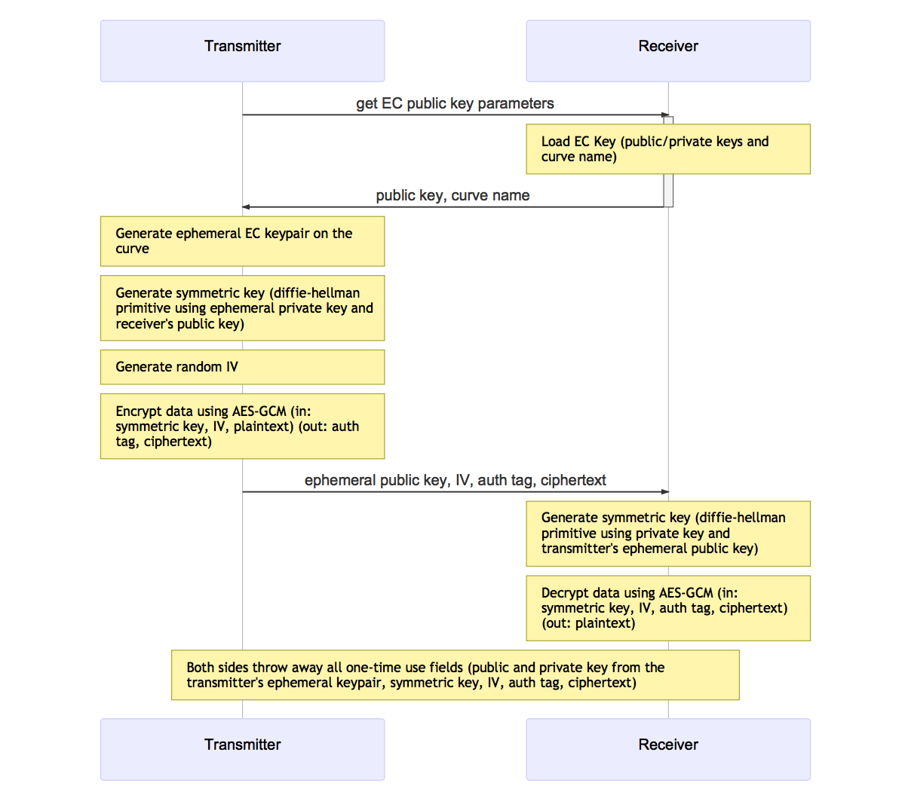

# Elliptic Curve Integrated Encrypt Scheme (ECIES)

## Introduction

This program is a proof-of-concept demonstrating an encrypted message
exchange between two entities using Elliptic Curve Cryptography. ECC
public/private key crypto is used in conjunction with the Diffie-Hellman
primitive to allow both sides to independently generate a one-time use
shared secret key that is used for encryption of data using a symmetric
key algorithm. This protocol is originally defined as the Elliptic Curve
Integrated Encryption Scheme (ECIES) though is slightly modified to not
use a KDF function and HMAC algorithm for authentication and integrity
checking. Instead those functions are replaced with AES-GCM which
simplifies the interaction and continues to satisfy the authentication
and integrity requirements.
 
Execution mimics both the Transmitter and Receiver communicating using
ECIES. At a high level the flow is as follows:

1. Receiver loads the EC key (public/private/curve)
2. Receiver sends its public key and curve to the Transmitter
3. Transmitter generates a new ephemeral EC key on the curve
4. Transmitter generates the shared symmetric key
5. Transmitter encrypts the data and sends its public key and ciphertext to the Receiver
6. Receiver generates the shared symmetric key
7. Receiver descrypts the data

## Building

Two implementations of the above ECIES scheme exist here. One using OpenSSL and
another using WolfSSL. They are compile using `make`. Change the OpenSSL and
WolfSSL arguments as needed in the Makefile based on the installation locations
of the libraries on your system. This generates two binaries named `ossl` and
`wssl` for an OpenSSL and WolfSSL implementation respectively of the ECIES
scheme.

```
% make
```

## Running

The Receiver's EC key is pulled from a DER file created using the OpenSSL
`ecparam` command. Use the following command to generate an EC keypair
on the `prime256v1` named curve. A new file named `ecc_key.der` will be
created.

```
% make cert
```
Run the programs with a single filename argument specifying the DER file that
contains the Receiver's EC key.

OpenSSL version:
```
% ./ossl ecc_key.der
```

WolfSSL version:
```
% ./wssl ecc_key.der
```

## Example

```
% ./wssl ecc_key.der
curve     : SECP256R1(7)
**********************************************
*  (ECIES RECEIVER) EC KEY LOADED FROM FILE  *
**********************************************
pubkey    : 0417ad77452c0e41957ac6ed42f350e7556c3089a0a657bc314c8b905119950fc304ff3a562907ee368fe6cffc31e204fb1a0517e365db43196b579fdccd7d11df
privkey   : a071ee58d38f8d0f73fe968c7525c916f7d305287956ed28ba29a1574a758f4a
curve     : SECP256R1(7)

-> (receiver) sends public key, curve name...

*******************************************************************
*  (ECIES TRANSMITTER) EPHEMERAL EC PUBLIC KEY AND SYMMETRIC KEY  *
*******************************************************************
epubkey   : 041186690ef9ef7830af27427bea7b88a6c9152c2b2f73cbb64f879ae854e6072863892041c8cbd7605ddab2e28a9dab998489352a1d77fedbbcf993628651767e
symkey    : 9f9b3cad38c2bd9bb3fe3f878f1e5a14b7426df9a6ab2fe398bafb0a4ec71f0e
************************************************
*  (ECIES TRANSMITTER) AES-GCM ENCRYPTED DATA  *
************************************************
plain-tx  : (45) The quick brown fox jumps over the lazy dog!
iv        : ef64f70ec2022707134b595d
tag       : df0545a738c25cfb3d7d5365
cipher    : f4b5c52617ffdada30e9ed45ce3f4f3adaad24df0f2d511809db4b3e22db1309546134225276d9b30f8590e687

-> (transmitter) sends ephemeral public key, IV, tag, ciphertxt...

************************************
*  (ECIES RECEIVER) SYMMETRIC KEY  *
************************************
symkey    : 9f9b3cad38c2bd9bb3fe3f878f1e5a14b7426df9a6ab2fe398bafb0a4ec71f0e
*********************************************
*  (ECIES RECEIVER) AES-GCM DECRYPTED DATA  *
*********************************************
plain-rx  : (45) The quick brown fox jumps over the lazy dog!
```

## ECIES Overview Flow Diagram



